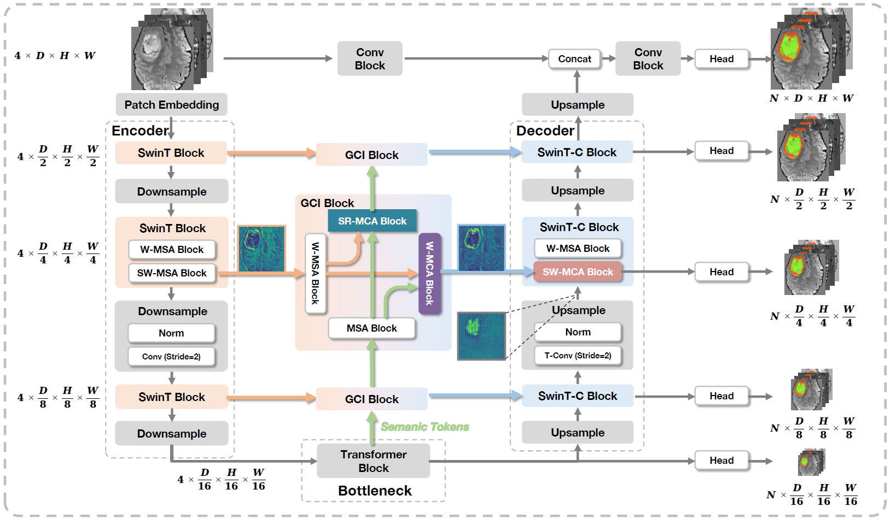

# GCIFormer: Global Context Interaction Transformer for Volumetric Medical Image Segmentation

All code and data will be made available after the peer review process.

## Model Overview

Overall architecture of GCIFormer. It adopts a U-shaped structure and mainly consists of a decoder, a bottleneck, a head, and GCI blocks. The GCI blocks integrate the semantic tokens with the lateral output features of the encoder and feed the refined features into the decoder.

